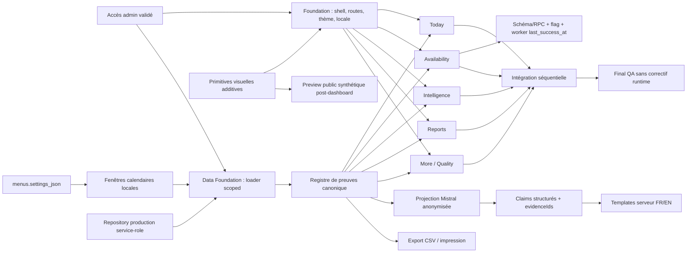

# Vistaire Admin vNext — Auto-revue d'architecture

**Date :** 2026-08-11 
**Portée inspectée :** `app/admin/**`, `components/admin/**`, `lib/admin/**`, `lib/analytics/**`, tests admin/E2E, contrats Supabase connus et cinq références `1448 × 1086` 
**Base :** `origin/main@a8f321fdb33cbb12dda6249e37a60a679183d4ea` 
**Méthode :** graphe de dépendances, recherche de hotspots, seams de test, frontières de responsabilité et analyse symptôme → source → conséquence → remède. Aucun score synthétique n'est produit : les références partagées optionnelles du skill Brooks n'étaient pas présentes localement, donc aucune formule ou règle manquante n'a été inventée.

## 1. Verdict

L'architecture est cohérente si les deux fondations restent des gates bloquants. Les pages existantes donnent une base fonctionnelle, mais leurs contrats actuels figent UTC, un modèle analytics trop binaire et des preuves insuffisantes pour les maquettes. La stratégie proposée réduit ce risque en séparant :

1. la présentation et les préférences;
2. le scope, le temps et la vérité des métriques;
3. les projections de page;
4. les capacités opérationnelles optionnelles;
5. l'intégration et la preuve QA.

Le principal compromis est assumé : livrer moins de chiffres au départ pour empêcher les pages et l'assistant de présenter des données non mesurées. La fidélité fonctionnelle prime sur le remplissage visuel.

## 2. Findings bloquants

### P0-1 — Temps local absent du loader

**Symptôme.** Le dashboard expose `timezone: null` et des plages `today-utc|7d|30d`. 
**Source.** `lib/admin/dashboardData.ts` ne sélectionne pas `menus.settings_json`; `lib/admin/dashboardRange.ts` découpe le jour et les comparaisons en UTC. 
**Conséquence.** « Aujourd'hui » et les comparaisons traversant le DST peuvent attribuer des événements au mauvais service. Une durée UTC égale n'est pas une période calendaire locale égale. 
**Remède.** Data Foundation introduit un fuseau IANA avec provenance, un fallback UTC explicite et des fenêtres locales testées au DST. Les pages de vague 2 ne commencent pas avant revue de ce contrat.

### P0-2 — Scope service-role insuffisamment typé

**Symptôme.** Le lecteur analytics générique accepte un `menuId` optionnel. 
**Source.** `lib/analytics/serverRows.ts` sert plusieurs usages avec un contrat plus large que le dashboard. 
**Conséquence.** Une future réutilisation peut lire un ensemble restaurant-wide ou mélanger des événements de menu sans que le type ne l'interdise. 
**Remède.** Après la lecture de pré-résolution du menu depuis l'accès restaurant validé, imposer un `ProductionAdminMetricScope` complet `{ restaurantId, menuId, source: "production", timezone }` à chaque lecture catalogue/analytics, avec bornes supplémentaires pour analytics, puis vérifier chaque ligne en postcondition. Le lecteur générique n'est pas renforcé au risque de casser ses autres consommateurs.

### P0-3 — États analytiques trop faibles

**Symptôme.** La troncature rend tout le bloc analytics indisponible; un restaurant calme paraît « stale »; certains consommateurs peuvent transformer absence en zéro. 
**Source.** `lib/admin/analyticsState.ts`, `analyticsPresentation.ts` et `dashboardData.ts` entremêlent disponibilité de lecture, fraîcheur d'événement et présentation. 
**Conséquence.** Une panne analytics masque des snapshots catalogue fiables, tandis qu'une absence de trafic ressemble à une panne ou à un zéro mesuré. 
**Remède.** Union fermée `available|insufficient|unmeasured|unavailable|error|truncated`, valeur uniquement dans `available`, fraîcheur basée sur la lecture/couverture et propagation de troncature par dépendance.

### P0-4 — Funnel et métriques de maquette non prouvés

**Symptôme.** Le funnel actuel est inféré depuis l'ordre de lignes en mémoire; plusieurs signaux demandés ne sont pas émis uniformément. 
**Source.** `lib/admin/analyticsState.ts` infère des étapes sans instrumentation de corrélation; `session_started`, `session_duration`, `search_used` et `filter_used` ont une couverture partielle ou démo. 
**Conséquence.** Un funnel, une durée ou un taux de succès donneraient une précision visuelle sans preuve comportementale. 
**Remède.** Registre d'instrumentation versionné avec preuve de déploiement production et intervalle par renderer/signal; `coversEntirePeriod` doit couvrir toute la fenêtre current ou previous, sinon l'état reste `unmeasured`. Les labels parlent d'interactions observées. CA, ventes, commandes et conversion commerciale sont exclus du type de métrique.

### P0-5 — Confidentialité comparative des recherches

**Symptôme.** Le seuil k=3 protège la période courante, mais `previousCount` peut révéler un faible volume passé. 
**Source.** `lib/admin/analyticsPresentation.ts` n'applique pas le seuil indépendamment aux deux périodes. 
**Conséquence.** Une comparaison peut divulguer une requête rare, potentiellement personnelle. 
**Remède.** Politique partagée ingestion/agrégation avec NFKC, PII, bidi, longueur et sessions distinctes. Agréger current et previous par deux appels bornés indépendants avant comparaison; `2 current + 1 previous` ne satisfait jamais k=3. Aucun compte précédent ni taux lorsque le baseline échoue.

### P0-6 — Assertions quantitatives de l'assistant

**Symptôme.** Interdire seulement les chiffres dans une réponse libre n'empêche pas « double », « moitié », un rang ou un nombre écrit en lettres. 
**Source.** Le futur adaptateur pourrait accepter de la prose générée après projection de données. 
**Conséquence.** Mistral peut reformuler, arrondir ou inventer une assertion non liée au registre. 
**Remède.** Le modèle retourne uniquement des `claimType` allowlistés et des `evidenceIds`; le serveur rend toute phrase quantitative via templates FR/EN et valeurs du registre. Référence inconnue ou audience interdite : échec fermé. Seul un quota `allowed` autorise le transport Mistral; `denied|unavailable|error` rendent le fallback sans appel modèle.

### P0-7 — Planification sans preuve d'exécution

**Symptôme.** La maquette Availability montre des retours planifiés, mais le dépôt n'a ni historique, ni planning, ni worker démontré. 
**Source.** Les capacités actuelles couvrent le changement immédiat, pas l'exécution différée. 
**Conséquence.** Enregistrer seulement un timestamp dans l'UI simulerait une opération qui ne sera jamais appliquée. 
**Remède.** Capacité détectée par version de schéma/RPC, flag serveur et `last_success_at` worker récent, avancé uniquement après succès transactionnel du RPC. Un attempt/heartbeat suivi d'un échec ne prouve pas l'exécution. Sans ces preuves, le scheduling est explicitement indisponible et le toggle immédiat reste indépendant. Les heures locales DST inexistantes sont rejetées et les heures répétées exigent `earlier|later`.

### P0-8 — Validation de migration indisponible localement

**Symptôme.** Supabase CLI, Docker et `psql` ne sont pas disponibles sur le poste inspecté. 
**Source.** Aucun runner Postgres local/éphémère n'est configuré dans l'environnement actuel. 
**Conséquence.** RLS, permissions, idempotence, DST et concurrence ne peuvent pas être déclarés validés. 
**Remède.** Les branches Availability et Intelligence/AI peuvent écrire leurs migrations et tests, mais leur review reste bloquée jusqu'à un Postgres isolé ou une branche Supabase éphémère. Le gate exige URL et project ref éphémères, un project ref production distinct, `psql -X --no-psqlrc`, une identité DB journalisée sans secret et des advisors verts. Les migrations ne supposent aucun default grant : elles activent RLS, révoquent explicitement tables, séquences et fonctions à `PUBLIC`/`anon`/`authenticated`, n'accordent que le minimum à `service_role`, fixent `search_path=''` pour tout `security definer` et testent les ACL effectives. Aucune application production.

## 3. Findings importants

### P1-1 — Couplage des primitives à la preview publique

**Symptôme.** `components/admin/system/AdminPresentationPrimitives.tsx` est déjà importé hors du dashboard. 
**Source.** La première preview restaurateur réutilise des primitives admin. 
**Conséquence.** Un renommage ou changement de défaut dans Foundation peut casser une route publique avant le chantier de parité. 
**Remède.** Évolution additive, variants explicites, test de contrat public conservé. Le chantier public ultérieur dépend uniquement de primitives visuelles et d'une fixture synthétique.

### P1-2 — Navigation cinq routes avant disponibilité des pages

**Symptôme.** Foundation doit figer cinq destinations alors que `/admin/reports` et `/admin/more` n'existent pas encore. 
**Source.** Les routes appartiennent à des vagues ultérieures. 
**Conséquence.** Déployer Foundation isolément pourrait exposer deux 404. 
**Remède.** Foundation est une branche non déployée; les pages de vague 2/3 sont intégrées avant QA et livraison. Les tests Foundation valident le registre des liens, pas leur disponibilité production isolée.

### P1-3 — CSV comme frontière de sécurité

**Symptôme.** Un export fidèle peut contenir des termes de recherche commençant par des caractères de formule. 
**Source.** Les recherches sont du contenu utilisateur non fiable. 
**Conséquence.** Excel ou un tableur peut exécuter une formule à l'ouverture. 
**Remède.** Encoder côté serveur et neutraliser `=`, `+`, `-`, `@`, tabulation et retour chariot avant sérialisation. Tester formule, Unicode et retours ligne.

### P1-4 — Ingestion client forgeable

**Symptôme.** L'endpoint peut recevoir des slugs dish/category qui ne sont pas validés contre le menu; les événements viennent de clients publics. 
**Source.** `lib/analytics/context.ts` valide le contexte général, pas chaque dimension; aucun rate limit/idempotence durable n'est prouvé. 
**Conséquence.** Les volumes ne représentent pas une vérité humaine inviolable. 
**Remède.** Validation d'appartenance, version d'instrumentation réservée, contrôles same-origin/Sec-Fetch-Site, rate limit distribué et idempotence durable. Jusque-là, provenance et wording restent « signal observé ».

### P1-5 — Conflits d'ownership potentiels

**Symptôme.** Les pages actuelles importent composants, analytics et CSS transversaux; plusieurs workstreams pourraient corriger les mêmes fichiers. 
**Source.** L'organisation actuelle reflète trois pages historiques, pas neuf chantiers parallèles. 
**Conséquence.** Les conflits seraient résolus dans l'intégrateur, diluant la responsabilité et la revue. 
**Remède.** Zones interdites explicites, noms de tests par workstream, branches de pages créées seulement depuis B1 et retour au propriétaire sur tout conflit fonctionnel.

## 4. Seams de test requis

### 4.1 Horloge et temps

`resolveAdminObservationWindow({ range, observedAt, timezone })` reçoit une horloge figée. Les tests couvrent minuit, cutoff, DST de printemps et d'automne, et fuseau invalide sans dépendre de la timezone de la machine.

### 4.2 Repository

`loadAdminDataBundleWithDependencies(input, dependencies)` injecte readers catalogue/analytics et clock. Les tests simulent pagination, ligne cross-scope, échec indépendant, troncature et absence de réglage timezone sans réseau ni secret.

### 4.3 Registre

Les agrégateurs sont purs. Un même bundle projeté vers `ui`, `export` et `mistral` garde les mêmes valeurs autorisées. Les tests sérialisent le résultat pour prouver l'absence de lignes brutes, scope privé et `session_id`.

### 4.4 Assistant

L'adaptateur reçoit un client Chat Completions injecté. Le mock CI retourne claims valides, invalides, cross-bundle, prose, timeout et prompt injection. Le renderer serveur est testé séparément dans les deux langues.

### 4.5 Capabilités opérationnelles

Availability injecte le repository de capacité et l'horloge du worker. Les tests distinguent schéma absent, permission refusée, flag coupé, `last_success_at` absent/périmé/invalide/futur et attempt récent suivi d'un échec RPC. L'échec du planning ne désactive pas la mutation immédiate.

### 4.6 Interface

Les pages reçoivent des bundles déterministes, jamais des événements bruts. Playwright vérifie clavier, focus, contraste, overflow, thèmes, langues et états de métrique à `390`, `430`, tablette et desktop.

## 5. Analyse de dépendances

### Couplages autorisés

- Pages → Foundation pour le shell et les primitives.
- Pages → Data Foundation pour les types, preuves et projections.
- Assistant/Reports → registre de preuves, jamais les raw events.
- Preview publique → primitives de présentation additives et fixture synthétique.

### Couplages interdits

- Foundation → loader ou métriques métier.
- Data Foundation → React, CSS ou pages.
- Page → Supabase service-role ou lecture brute.
- Assistant → mutation ou valeur quantitative non issue d'une preuve.
- Preview publique → accès admin, cookie admin, API admin ou dataset production.
- Intégrateur → résolution fonctionnelle ou édition source.

## 6. Loi de Conway et ownership

La structure du code doit suivre les responsabilités de livraison : Foundation possède l'expérience commune, Data Foundation la vérité partagée, chaque page sa projection, QA la preuve transversale. Sans cette correspondance, le groupe qui assemble les branches deviendrait de facto propriétaire de tout conflit. L'intégrateur est volontairement sans capacité de développement : il conserve la traçabilité vers l'équipe/worktree qui connaît le contrat.

La structure de l'équipe humaine permanente n'est pas documentée dans le dépôt. Cette revue ne suppose donc pas d'organigramme; elle définit seulement l'ownership temporaire nécessaire à l'exécution sûre.

## 7. Analyse des compromis

| Décision | Gain | Coût accepté | Garde-fou |
|---|---|---|---|
| Deux fondations avant les pages | Contrats stables et cohérents | Démarrage visuel différé | Revue P0/P1 et B1 gelée |
| Registre de preuves unique | Même valeur UI/export/IA | Modèle plus explicite | Projections par audience et tests d'identité |
| Absence visible | Pas de faux chiffre | Certaines maquettes restent moins remplies | États premium dédiés |
| Repository admin dédié | Scope impossible à omettre | Duplication limitée du lecteur générique | Interface étroite et postconditions |
| Mistral claims-only | Pas d'invention quantitative | Prose moins libre | Templates FR/EN et fallback règles |
| Scheduling conditionnel | Pas de fausse commande | Feature bloquée sans infra | Version + flag + `last_success_at` transactionnel |
| Preview après dashboard | Pas de fuite privée | Parité marketing plus tardive | Fixture synthétique et test réseau |

## 8. Conditions de sortie de l'architecture

La revue P0/P1 des deux fondations doit confirmer :

- aucun scope optionnel;
- aucune plage UTC présentée comme locale;
- aucun zéro sans mesure;
- aucune couverture considérée complète sans preuve de déploiement vérifiée sur toute la fenêtre;
- aucune recherche comparative sous k=3;
- aucune métrique interdite dans `AdminMetricId`;
- aucune raw row/session côté client;
- aucune valeur Mistral hors preuve;
- aucun appel Mistral pour un quota autre que `allowed`;
- aucune migration Availability ou Intelligence/AI marquée validée sans Postgres isolé, project refs distincts et identité DB non secrète;
- aucun fichier transversal modifié par une branche de page;
- compatibilité de la preview publique conservée.

Le résultat final reste conditionnel aux gates d'exécution. Cette revue approuve la structure et les frontières, pas un comportement qui n'a pas encore été implémenté ou testé.
