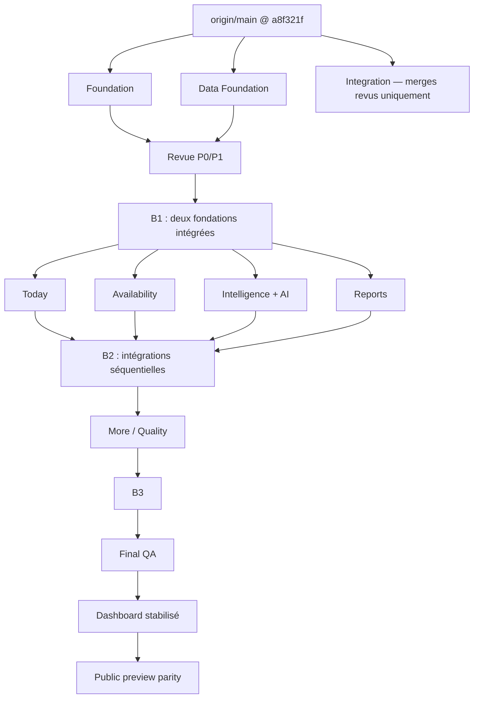

# Vistaire Admin vNext — Spécification consolidée

**Date :** 2026-08-11<br>
**Statut :** architecture approuvée, prête pour planification exécutable<br>
**Base gelée :** `origin/main@a8f321fdb33cbb12dda6249e37a60a679183d4ea`<br>
**Branche documentaire :** `feat/admin-vnext-foundation`<br>
**Intégrateur :** `feat/admin-vnext-integration`, réservé aux intégrations revues<br>
**Références visuelles :** `1.png` à `5.png`, chacune en `1448 × 1086 px`

## 1. Résultat produit

Vistaire Admin vNext devient le centre privé de pilotage d'un restaurant. Il doit donner une lecture honnête du menu publié, permettre les actions opérationnelles strictement autorisées et conserver la sensation d'une maison de restauration haut de gamme. Il ne devient ni un POS, ni un outil de réservation, ni un back-office générique, ni un tableau de chiffres décoratifs.

Les cinq destinations canoniques sont :

| ID stable | Route | Référence | Promesse |
|---|---|---|---|
| `today` | `/admin` | `1.png` | Aujourd'hui : état du service, signaux observés, alertes et actions sûres |
| `availability` | `/admin/availability` | `2.png` | Disponibilités immédiates, historique et retours réellement exécutables |
| `intelligence` | `/admin/insights` | `3.png` | Intelligence du menu et assistant adossés à des preuves |
| `reports` | `/admin/reports` | `4.png` | Bilan d'une période, comparaison et exports honnêtes |
| `more` | `/admin/more` | `5.png` | Qualité, contenus, informations restaurant et support |

La navigation conserve ces identifiants et routes sur desktop et mobile. « Qualité » est un domaine de la destination `more`, pas une sixième route de la première livraison.

## 2. Limites non négociables

- L'identité du restaurant et du menu vient exclusivement de l'accès admin validé côté serveur.
- Le dashboard réel n'accepte que le dataset `production`; il ne mélange jamais démo, test ou flux interne.
- Une valeur absente reste absente. Elle ne devient pas `0`, une estimation ou un texte positif.
- Les termes « observé », « événement » et « interaction » remplacent toute promesse de client unique ou de succès non prouvé.
- CA, ventes, commandes et conversion commerciale sont hors contrat et hors interface.
- L'assistant ne mute aucune donnée et ne peut pas inventer un nombre, un rang ou une comparaison.
- Les migrations sont versionnées et testables, mais jamais appliquées en production par ce chantier.
- Les fichiers bruts ou lourds des références ne sont pas ajoutés au dépôt. Les seuils de `docs/repo-asset-policy.md` restent autoritaires.
- Le checkout courant `ci/production-grade-pipeline`, déjà sale, n'est ni édité, ni nettoyé, ni rebasé.
- Aucun merge, push, PR, déploiement ou merge vers `main` n'est automatique.

## 3. Direction visuelle

### 3.1 Fidélité de référence

Les références définissent la hiérarchie, la densité, le rythme et la signature visuelle, sans imposer de recopier des données non disponibles. À `1448 × 1086`, l'implémentation vise :

- une colonne latérale fixe d'environ `184 px` avec mot-symbole Vistaire, cinq destinations et identité du restaurant;
- un canevas principal clair et respirant, bordures champagne très fines, cartes blanc cassé et ombres diffuses;
- titres éditoriaux en fonte locale BT Suave, texte fonctionnel en Neue Montreal;
- accents ambre/champagne pour navigation et actions primaires, vert pour états fiables, rouge réservé aux incidents;
- photographies culinaires seulement lorsqu'elles existent dans le catalogue réel et respectent la politique d'assets;
- visualisations sobres, avec valeurs accessibles en texte et sans dépendance de charting supplémentaire;
- mouvement retenu, désactivable via `prefers-reduced-motion`.

Les primitives sont conçues en variables CSS sémantiques plutôt qu'en couleurs ponctuelles : surfaces, texte, bordure, accent, succès, avertissement, danger et focus.

### 3.2 Thème sombre

Le thème sombre ne transforme pas Vistaire en terminal ou SaaS froid. Il utilise des surfaces brun-noir chaudes, du texte crème, des bordures champagne atténuées et des photos non assombries artificiellement. Le contraste WCAG AA est vérifié dans les deux thèmes. Le choix est rendu côté serveur pour éviter le flash de thème.

### 3.3 Responsive mobile-first

Les largeurs `390 px` et `430 px` sont des gates, pas des réductions tardives du desktop :

- la sidebar devient une barre de navigation basse à cinq destinations avec `safe-area-inset-bottom`;
- le contenu garde une largeur fluide sans débordement horizontal;
- les tuiles KPI passent à une ou deux colonnes selon l'espace;
- les tableaux deviennent listes sémantiques ou cartes détaillées; aucune table desktop n'est simplement compressée;
- les graphiques gardent une description textuelle et une zone de toucher d'au moins `44 × 44 px`;
- l'assistant Intelligence devient un drawer accessible et refermable;
- les actions destructrices ou sensibles restent nommées et confirmables;
- la hiérarchie de lecture reste : titre, état, preuve, action.

Les paliers QA sont `390`, `430`, tablette, puis `1448 × 1086`.

## 4. Fondation d'interface

### 4.1 Routes

```ts
export const ADMIN_ROUTES = [
  { id: "today", href: "/admin" },
  { id: "availability", href: "/admin/availability" },
  { id: "intelligence", href: "/admin/insights" },
  { id: "reports", href: "/admin/reports" },
  { id: "more", href: "/admin/more" },
] as const;

export type AdminRouteId = (typeof ADMIN_ROUTES)[number]["id"];
export type AdminTheme = "light" | "dark";
export type AdminLocale = "fr" | "en";
```

Le shell fournit navigation, en-tête, actions « Voir la carte » et « Actualiser », statut du menu, sélecteurs FR/EN et clair/sombre, focus skip-link et états génériques loading/error/empty. Les pages possèdent leur copy et leurs états métier.

### 4.2 Préférences SSR

Les cookies sont limités à `/admin`, `SameSite=Lax` et validés avant usage :

- `vistaire-admin-locale=fr|en`;
- `vistaire-admin-theme=light|dark`.

Le proxy supprime toute tentative client de forger les headers internes puis réinjecte les valeurs validées pour les routes admin. Le layout racine rend `lang` et les attributs de thème dès le SSR. Le choix admin n'altère pas les routes publiques `/en` ni les préférences de menu public. Aucun `suppressHydrationWarning` ne masque une divergence.

### 4.3 Ownership des primitives

Foundation est seul propriétaire de `components/admin/system/**`, `components/admin/charts/**` et des tokens/styles de shell. Les worktrees de page composent ces exports sans les dupliquer. `AdminPresentationPrimitives.tsx`, déjà consommé par l'aperçu public, évolue uniquement de façon additive et rétrocompatible jusqu'au chantier de parité publique.

## 5. Fondation de données

### 5.1 Scope obligatoire

```ts
export type AdminDatasetSource =
  | "production"
  | "demo"
  | "internal"
  | "test";

export type IanaTimeZone = string & {
  readonly __brand: "IanaTimeZone";
};

export type AdminMetricScope<S extends AdminDatasetSource = AdminDatasetSource> =
  Readonly<{
    restaurantId: string;
    menuId: string;
    source: S;
    timezone: IanaTimeZone;
  }>;

export type ProductionAdminMetricScope = AdminMetricScope<"production">;
```

Aucun champ de scope n'est optionnel. Le repository admin réel reçoit un `ProductionAdminMetricScope` construit depuis l'accès serveur; il ne prend ni restaurant, ni menu, ni source depuis l'URL ou le body.

### 5.2 États de métrique

```ts
export type AdminMetricState<T> =
  | { kind: "available"; value: T }
  | {
      kind: "insufficient";
      reason:
        | "no-events"
        | "sample-too-small"
        | "privacy-threshold"
        | "comparison-unavailable";
    }
  | {
      kind: "unmeasured";
      reason:
        | "not-instrumented"
        | "instrumentation-unverified"
        | "unsupported-signal";
    }
  | {
      kind: "unavailable";
      reason:
        | "not-applicable"
        | "timezone-unconfigured"
        | "schema-not-deployed"
        | "worker-not-active";
    }
  | {
      kind: "error";
      code: "configuration" | "database" | "query" | "scope-integrity";
      retryable: boolean;
    }
  | { kind: "truncated"; observedRows: number; rowLimit: number };
```

Seul `available` contient une valeur. La troncature ne contamine que les métriques dérivées de la lecture tronquée; le catalogue peut rester utilisable si la lecture analytics échoue.

### 5.3 Fuseau et fenêtres

Le loader lit `menus.settings_json` et distingue :

- `configured`: timezone IANA valide provenant de `menus.settings_json`;
- `fallback`: `UTC`, raison `missing|invalid`, visible dans la provenance.

Le fallback autorise les totaux non temporels. Les métriques dépendant du calendrier local deviennent `unavailable/timezone-unconfigured`; elles ne se présentent pas comme Toronto par défaut.

Les plages canoniques sont `today`, `7d` et `30d`. Elles sont définies en dates calendaires locales, puis converties en UTC. Pour `today`, la comparaison va de la veille locale à la même heure locale. Pour `7d` et `30d`, les périodes précédentes comptent le même nombre de dates locales et le même cutoff local. Les durées UTC peuvent différer d'une heure au DST. Les tests fixent `America/Toronto` aux 8 mars et 1er novembre 2026, y compris les deux buckets `01 h` avec offsets distincts à l'automne.

La fraîcheur décrit la date de lecture et la couverture de l'instrumentation, pas l'âge du dernier événement. Un restaurant calme n'est pas déclaré périmé.

### 5.4 Repository et agrégation

Le service role reste strictement serveur dans un repository dédié :

- colonnes et tables allowlistées;
- après la lecture de pré-résolution du menu depuis l'accès restaurant validé, chaque lecture catalogue/analytics reçoit un `ProductionAdminMetricScope` complet `{ restaurantId, menuId, source: "production", timezone }`; les lectures analytics exigent en plus leurs bornes;
- borne haute figée au même `observedAt` pour toutes les lectures;
- pagination déterministe et lecture `maxRows + 1` pour prouver la troncature;
- postcondition de scope et de fenêtre sur chaque ligne;
- métadonnées réduites à une allowlist avant agrégation;
- aucune ligne brute, aucun `session_id` et aucun message Supabase détaillé envoyés au client.

Le catalogue, la période courante et la période précédente échouent indépendamment. Le loader canonical ne retourne que le registre de preuves et les projections nécessaires.

### 5.5 Instrumentation et vérité mesurable

Le registre d'instrumentation documente version, source, renderers couverts, signal attendu, `coverageStartAt`, `coverageEndAt` et une preuve de déploiement production vérifiée. L'absence d'un événement n'est un zéro que si cette preuve existe et qu'un intervalle de couverture `covered` englobe toute la période courante ou précédente concernée. Une preuve absente/non vérifiée ou une couverture absente, partielle, commencée après la borne basse ou terminée avant la borne haute rend l'état `unmeasured/instrumentation-unverified`.

Les métriques initialement admissibles, sous réserve de lecture complète et de seuil, sont : ouvertures de menu observées, ouvertures de plat observées, intentions immersives/AR observées, sessions observées, snapshots catalogue, classements de plats/catégories, série d'activité, distribution temporelle et recherches k-anonymisées.

Restent obligatoirement `unmeasured` tant que leurs contrats ne sont pas déployés et prouvés :

- sessions actives;
- durée moyenne;
- recherches sans résultat;
- usage des filtres;
- funnel;
- succès 3D et succès AR;
- performance mobile;
- erreurs d'assets.

CA, ventes, commandes et conversion commerciale ne font pas partie de `AdminMetricId`.

### 5.6 Confidentialité des recherches

La politique partagée ingestion/agrégation applique NFKC, retire contrôles et bidi, normalise les espaces, limite à 80 caractères et rejette email, téléphone, URL, IP, code postal, adresse et marqueurs factices de PII. Un terme nécessite au moins trois sessions distinctes. Le seuil s'applique séparément aux périodes courante et précédente; aucun `previousCount` ni taux n'est exposé si la période précédente échoue. Les termes ressemblant à une prompt injection peuvent rester dans l'UI après anonymisation mais sont retirés de la projection Mistral.

## 6. Registre de preuves et assistant

### 6.1 Registre canonique

```ts
export type EvidenceId = string & { readonly __brand: "EvidenceId" };

export type AdminEvidenceRecord = Readonly<{
  evidenceId: EvidenceId;
  metricId: AdminMetricId;
  definitionVersion: string;
  labelKey: string;
  state: AdminMetricState<AdminEvidencePayload>;
  period: "current" | "previous" | "snapshot";
  provenance: AdminEvidenceProvenance;
  freshness: AdminEvidenceFreshness;
  sample: AdminEvidenceSample;
  privacy: AdminEvidencePrivacy;
  audiences: readonly ("ui" | "export" | "mistral")[];
}>;
```

Un bundle contient un scope unique. Ses IDs sont déterministes et n'embarquent pas l'identité restaurant/menu. UI, exports et assistant lisent la même valeur. Toute preuve inconnue, cross-bundle ou non autorisée pour l'audience échoue fermée.

### 6.2 Contrat Mistral

Le registre et le corpus d'évaluation précèdent le drawer. Le transport reste un `fetch` serveur vers `POST /v1/chat/completions`, avec le modèle lu dans `MISTRAL_MODEL`, conformément aux documentations officielles [Chat Completions](https://docs.mistral.ai/api/endpoint/chat) et [Custom Structured Outputs](https://docs.mistral.ai/studio/conversations/structured-output/custom). Aucun SDK ni nouvelle dépendance n'est introduit. Mistral reçoit seulement une projection agrégée et anonymisée, puis retourne des conclusions structurées :

```ts
type ApprovedClaimType =
  | "metric-observation"
  | "period-comparison"
  | "rank-observation"
  | "attention-observation";

type AssistantClaim = {
  claimType: ApprovedClaimType;
  evidenceIds: readonly EvidenceId[];
};
```

Chaque requête fournit `response_format.type = "json_schema"` et un schéma strict nommé `admin_assistant_claims`. L'objet racine n'autorise que `claims`; chaque item de `claims` exige exactement `claimType` et `evidenceIds`; `additionalProperties: false` s'applique à la racine et à chaque claim. `claimType` est limité à l'enum local `ApprovedClaimType` et chaque `evidenceId` doit ensuite appartenir à l'allowlist de la projection `mistral` du bundle courant :

```json
{
  "type": "json_schema",
  "json_schema": {
    "name": "admin_assistant_claims",
    "strict": true,
    "schema": {
      "type": "object",
      "additionalProperties": false,
      "required": ["claims"],
      "properties": {
        "claims": {
          "type": "array",
          "items": {
            "type": "object",
            "additionalProperties": false,
            "required": ["claimType", "evidenceIds"],
            "properties": {
              "claimType": {
                "type": "string",
                "enum": [
                  "metric-observation",
                  "period-comparison",
                  "rank-observation",
                  "attention-observation"
                ]
              },
              "evidenceIds": {
                "type": "array",
                "items": { "type": "string" },
                "uniqueItems": true
              }
            }
          }
        }
      }
    }
  }
}
```

Le serveur parse le contenu complet une seule fois avec `JSON.parse`, valide localement le schéma fermé puis les allowlists de claims et de preuves avant tout rendu. Il n'extrait jamais une sous-chaîne entre la première `{` et la dernière `}`, ne retire pas de fence Markdown, ne répare pas le JSON et ne retente pas en `json_object` ou en JSON libre. Si `MISTRAL_MODEL` ou la configuration manque, si le modèle refuse/ne supporte pas JSON Schema, si le transport échoue ou si la réponse est invalide, le chemin Mistral échoue fermé vers le fallback déterministe.

Le modèle ne rédige pas de phrase quantitative libre. Le serveur choisit un template FR/EN et injecte rangs, nombres et comparaisons depuis les preuves référencées. Cette contrainte couvre aussi nombres écrits en lettres, « double », « moitié » ou formulations équivalentes.

Le pipeline inclut : validation locale de schéma, timeout, rate limit, isolation restaurant/menu, prompt-injection tests, corpus FR/EN, mock déterministe en CI, fallback par règles et refus de toute mutation. Seul le résultat de quota `allowed` autorise un appel Mistral; `denied|unavailable|error` échouent fermés vers le fallback sans appel modèle. Seuls des booléens de présence de `MISTRAL_API_KEY` et `MISTRAL_MODEL` et des codes d'erreur neutres peuvent être journalisés; aucune valeur de secret, aucun prompt, aucune question, aucune preuve ou donnée brute ne l'est.

## 7. Contrats par destination

### 7.1 Aujourd'hui

La page assemble uniquement des preuves disponibles : briefing du service, pulse, cartes métriques, progression, alertes, plats consultés, chronologie, recherches admises par la confidentialité, santé du menu et actions sûres. Un bloc non mesuré rend un état premium explicite au lieu d'une carte chiffrée factice. Les quick actions Today sont exclusivement des navigations GET vers des routes autorisées; elles ne déclenchent aucune mutation directe ou indirecte.

### 7.2 Disponibilités

Le toggle immédiat conserve l'atomicité et l'autorisation existantes. Historique et retour planifié exigent un schéma/RPC versionné, un flag serveur et, pour l'exécution différée, un worker dont `last_success_at` récent n'est avancé qu'après succès transactionnel du RPC. Un attempt ou heartbeat suivi d'un échec ne prouve pas l'exécution. Si l'une des preuves manque :

- le toggle immédiat reste utilisable;
- le retour planifié s'affiche comme indisponible;
- aucune commande simulée ni programmation locale n'est présentée comme enregistrée.

Une échéance saisie en heure locale est convertie côté serveur avec le timezone validé du scope. Les heures inexistantes au passage DST sont rejetées et les heures répétées exigent un choix explicite `earlier|later`; le timezone du navigateur ou du body ne peut pas remplacer celui du scope.

Les migrations appartiennent aux workstreams Availability et Intelligence/AI, en commits séparés et sans mutation de données de production. Chacune est testée sur Postgres local isolé ou branche Supabase éphémère pour RLS, permissions, idempotence et concurrence; Availability couvre aussi DST et advisory locks. Toute table exposable active RLS; les migrations révoquent explicitement les droits table/séquence et l'exécution des fonctions à `PUBLIC`, `anon` et `authenticated`, puis accordent seulement le minimum à `service_role`, sans dépendre des default grants Supabase. Toute fonction privilégiée fixe un `search_path` vide, qualifie ses objets et ses ACL sont vérifiées. Les gates vérifient une URL éphémère, un project ref éphémère distinct du project ref production, exécutent `psql -X --no-psqlrc` et ne journalisent qu'une identité DB non secrète. Les advisors Supabase doivent ensuite être verts. Une migration présente dans Git ne prouve jamais son déploiement.

### 7.3 Intelligence

La carte d'attention, les tops, le contexte, les scores et recommandations ne s'affichent que lorsqu'ils se déduisent du registre. Le funnel non instrumenté reste absent ou `unmeasured`. L'assistant est secondaire à l'analyse et n'apparaît pas avant les gates de registre, corpus et sécurité.

### 7.4 Rapports

Le bilan compare seulement des définitions, scopes, timezones et alignements identiques. Si le baseline vaut zéro, l'écart absolu peut être montré mais le taux reste `null`. Le CSV est généré côté serveur depuis la projection export du registre, encode explicitement UTF-8 et neutralise les cellules commençant par `=`, `+`, `-`, `@`, tabulation ou retour chariot. Le mode impression ne rajoute aucune donnée.

### 7.5 Plus / Qualité

Cette page projette l'état réel du QR, du menu publié, des photos, traductions, descriptions, allergènes et assets lorsqu'ils sont mesurables dans le catalogue. Performance mobile, taux de succès 3D/AR, erreurs d'assets, tickets et demandes restent absents ou non mesurés sans source fiable. Le support utilise les canaux déjà autorisés; il n'invente ni SLA ni disponibilité d'équipe.

## 8. Preview public post-dashboard

`feat/admin-vnext-public-preview-parity` commence seulement après stabilisation du dashboard. Les routes publiques sont `/apercu-restaurateur` et `/en/restaurant-preview`. Elles réutilisent les primitives visuelles exportées, jamais les loaders, cookies, routes API ou données privées admin. Une fixture synthétique déterministe porte des libellés explicites de démonstration. La sécurité vérifie l'absence de requêtes vers les endpoints admin et Supabase privé.

## 9. Sécurité et mutations

- Accès et capabilities sont vérifiés côté serveur à chaque lecture ou mutation sensible.
- Les mutations exigent même origine, content type, body strict, identité dish/menu vérifiée et état final idempotent.
- L'ingestion analytics valide l'appartenance de `dishSlug` et `categorySlug` au menu avant acceptation.
- Les signaux clients restent forgeables; la provenance les nomme donc « observés ». Same-origin/Sec-Fetch-Site, token court, rate limit distribué et idempotence durable sont des durcissements nécessaires avant d'augmenter le niveau de confiance.
- Les logs client restent neutres; les erreurs détaillées et identifiants restent côté serveur.
- Une erreur d'autorisation ne doit jamais être interprétée comme « schéma absent ».

## 10. Stratégie de livraison



Les quatre branches de vague 2 existent après B1, mais l'exécution sur cette plateforme se fait `3 + 1` : l'orchestrateur occupe un des quatre slots. L'intégration est séquentielle et relance les tests de contrat du propriétaire après chaque merge. Final QA ne corrige pas le runtime; chaque défaut repart dans la branche propriétaire, puis revient par un nouveau merge revu.

## 11. Gates d'acceptation

Chaque workstream passe ses tests ciblés, `npm run lint` et `npm run typecheck`. Les changements de code passent aussi `npm run assets:check`, `npm run lfs:check` et `npm run build`. Chaque migration a un gate Postgres local/éphémère distinct, rejoué au gate final de sa branche et bloquant avant commit/intégration de la migration.

La matrice finale exécute :

```powershell
npm run assets:check
npm run lfs:check
npm run lint
npm run typecheck
npm run build
npm run test:admin
npm run test:admin:qr
npm run test:admin:full-menu
npm run test:restaurateur-preview:node
npm run test:e2e
```

La QA navigateur couvre clair/sombre, FR/EN, `1448 × 1086`, tablette, `430 px` et `390 px`; console, réseau, 404/500, overflow, focus, contraste, reduced motion, performance, requêtes médias et absence de préchargement GLB/USDZ avant intention.

## 12. Critère de vérité

La livraison peut garantir le respect des contrats testés, du scope et des états d'absence. Elle ne peut pas garantir une vérité humaine absolue : la télémétrie publique reste déclarative et aucun environnement Postgres éphémère n'est actuellement disponible dans le poste local. Les fonctionnalités dépendantes restent donc bloquées ou dégradées explicitement jusqu'à preuve de schéma, worker et instrumentation.
